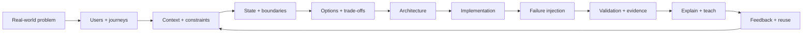

# Nidhi Verma — Engineering Casebook

I use software engineering, architecture, and AI to work through complex product and platform problems.

This casebook is organized around **real systems and the decisions they force**—not around technology names.

## Start with a platform problem

| Platform | Problem | Case |
|---|---|---|
| Assessment / talent | How do you scale realistic technical challenges without losing quality, integrity or trustworthy evaluation? | [Challenge-quality system](case-studies/06-building-a-challenge-quality-system.md) |
| Banking | How do payments, fraud, loans, ledger state and reconciliation remain consistent under failure? | [Banking platform](case-studies/07-banking-platform.md) |
| Retail | How do search, inventory, checkout and recommendations stay fast and trustworthy? | [Retail platform](case-studies/08-retail-platform.md) |
| Operations | How do you dispatch work when people, jobs and constraints change continuously? | [Operations platform](case-studies/09-operations-platform.md) |
| Music | How do you personalize discovery without creating cold-start and feedback-loop failures? | [Music platform](case-studies/10-music-platform.md) |
| Medical | How do you combine interoperability, privacy, evidence and AI without hiding uncertainty? | [Medical platform](case-studies/11-medical-platform.md) |
| Media / streaming | How do you process playback and product events at scale without coupling every downstream consumer to the customer path? | [Event-streaming platform](case-studies/13-event-streaming-platform.md) |
| Engineering platform | How do teams discover services, ownership and supported ways to build? | [Information fragments](case-studies/01-when-information-fragments.md) |

## The case-study format

Every flagship case uses the same layered reading model:

> **30-second read** → sharp takeaway
>
> **2-minute read** → mental model + why it matters
>
> **Deep dive** → architecture + technology choices + trade-offs + failure modes + validation + research

The goal is to make complex engineering understandable without flattening the complexity.

## The engineering loop



## Cross-platform problem patterns

The domain changes. The underlying engineering problems repeat.

Examples:

- duplicate payment → **idempotency**
- duplicate checkout → **idempotency**
- duplicate event delivery → **idempotent consumer**
- changing dispatch state → **state machine + re-planning**
- stale inventory/search → **source of truth + derived read model**
- AI decision under uncertainty → **policy boundary + evidence + evaluation**
- growing engineering complexity → **golden path + self-service + discoverability**
- recommendation degradation → **feedback-loop monitoring + multi-objective evaluation**

See the [Platform Problem Pattern Catalog](case-studies/13-platform-pattern-catalog.md).

## AI systems

AI is treated as an engineering component—not the entire solution.

- [Context Engineering for Regression Automation](articles/context-engineering-regression-automation.md)
- [LLM Evaluation Is a Systems Problem](articles/llm-evaluation-systems.md)
- [Making AI Systems Production-Ready](articles/ai-production-readiness.md)

## Evidence

Each case distinguishes:

1. **Portfolio design** — the system being proposed or implemented as a reference architecture.
2. **Real-world reference case** — an external system used to learn from.
3. **Research evidence** — papers, empirical studies, benchmarks, and first-party engineering documentation.

See [Research & Evidence](research/evidence-base.md).

## Actual projects

The older public repositories are not discarded. They are being audited and connected to the casebook where they contain useful engineering evidence.

See [Project Technology Inventory](engineering/project-inventory.md) for verified technologies, what each repository can demonstrate, and where a deeper source audit is still required.

The standard for a flagship project is:

**what we use → what it owns → why we use it → alternative → failure mode → production considerations**

## Build standard

A case is not considered complete because it has a diagram.

The eventual standard is:

```text
real problem
  ↓
reference application
  ↓
architecture
  ↓
working vertical slice
  ↓
deliberate failure cases
  ↓
observability
  ↓
evaluation
  ↓
technical explanation
  ↓
reusable pattern
```

Where original enterprise work is proprietary, examples are explicitly generalized. External systems are clearly labeled as references, never as personal claims.

## Connect

LinkedIn: https://www.linkedin.com/in/nidhiverma200/
