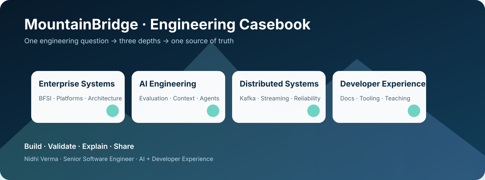
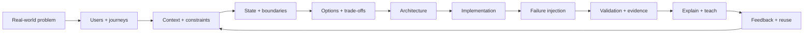

# Nidhi Verma — Engineering Casebook

> **Senior Software Engineer · AI Engineering · Distributed Systems · Developer Experience**

I build and explain enterprise systems by starting with the **problem, context, failure modes and evidence**—then choosing technology deliberately.



## Start here

**30-second view:** I have 11+ years of enterprise software engineering experience, with deep exposure to BFSI/platform systems and a growing focus on AI evaluation, context engineering, distributed systems and developer experience.

**Proof:** this repository connects architecture case studies, runnable engineering labs and technical writing.

**Conversation:** [LinkedIn](https://www.linkedin.com/in/nidhiverma200/)

## Current engineering focus

| Area | What I explore |
|---|---|
| **AI Engineering** | evaluation, agents, LLM-as-a-judge, context engineering, regression gates |
| **Distributed Systems** | Kafka, event contracts, idempotency, retries, DLQ, replay, streaming |
| **Enterprise Platforms** | architecture, modernization, reliability, validation, observability |
| **Developer Experience** | technical documentation, runnable labs, developer workflows, teaching |

## Flagship projects

### AI Evaluation
**[AIEvaluationAgentLab](https://github.com/MountainBridge/AIEvaluationAgentLab)** — private while the implementation is being developed. The target system covers test datasets, traces, deterministic evaluation, LLM-as-a-judge and regression gates.


### Event-driven systems
**[KafkaEventPlatform](https://github.com/MountainBridge/KafkaEventPlatform)** — event contracts, partitioning, consumer groups, idempotency, retries/DLQ, replay and observable failure handling.

### Real-time systems
**[Angular-sse](https://github.com/MountainBridge/Angular-sse)** — real-time browser streaming with deliberate failure scenarios: disconnects, duplicates, stale state, ordering, recovery and observability.

### Data engineering
**[PostgreSQLEngineeringLab](https://github.com/MountainBridge/PostgreSQLEngineeringLab)** · **[MongoDBEngineeringLab](https://github.com/MountainBridge/MongoDBEngineeringLab)** — database behaviour, consistency, indexing, query design and failure-aware API patterns.

## The engineering loop



## The content loop

```text
Engineering question
        ↓
30-second visual
        ↓
LinkedIn story / discussion
        ↓
GitHub case study / code / evidence
        ↓
Deep-dive article
        ↓
Reusable engineering pattern
```

The goal is not generic technical content. Each artifact should answer a concrete engineering question and show **how the decision was made**.

## Case-study standard

Every flagship case aims for:

**problem → context → architecture → working slice → deliberate failure → observability → evaluation → trade-offs → reusable pattern**

Where enterprise work is proprietary, examples are explicitly generalized. External systems are clearly labeled as references.

## Connect

- **GitHub:** https://github.com/MountainBridge
- **LinkedIn:** https://www.linkedin.com/in/nidhiverma200/

> **Build · Validate · Explain · Share**
