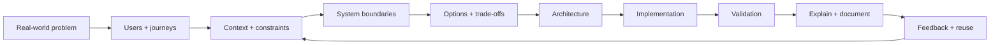

# Nidhi Verma — Engineering Casebook

Senior engineering work is rarely about knowing one more framework. It is about taking an ambiguous problem, finding the real constraints, choosing a workable system boundary, and making the solution understandable enough that other engineers can use and extend it.

This repository is a casebook of that kind of thinking.

## Start with a problem

| Problem | What to inspect | Reference case |
|---|---|---|
| Teams cannot find the right service, owner, API or documentation | [When the system becomes bigger than its documentation](case-studies/01-when-information-fragments.md) | Spotify / Backstage |
| Standards exist, but every team implements them differently | [How to create a paved road without creating a prison](case-studies/02-golden-paths-without-lock-in.md) | Google Cloud / Spotify |
| A platform grows through contributions and becomes inconsistent | [When contribution creates fragmentation](case-studies/03-platform-consistency-at-scale.md) | Shopify CLI |
| An AI system produces fluent answers that may still be wrong | [Why AI evaluation is an end-to-end system](case-studies/04-ai-that-looks-right.md) | LLM/RAG evaluation research |
| Regression knowledge lives in people and disappears between changes | [When regression becomes a knowledge problem](case-studies/05-regression-as-a-knowledge-system.md) | Generalized enterprise pattern |

## The reasoning pattern

The articles go deeper on the individual moves: [ambiguity → architecture](articles/ambiguity-to-architecture.md), [failure modes](articles/failure-modes-before-features.md), [architecture decisions](articles/architecture-decisions-that-survive.md), and [design thinking](articles/design-thinking-for-engineers.md).

## AI systems

The AI material follows the same engineering discipline rather than treating model output as the product:

- [Context Engineering for Regression Automation](articles/context-engineering-regression-automation.md)
- [LLM Evaluation Is a Systems Problem](articles/llm-evaluation-systems.md)
- [Making AI Systems Production-Ready](articles/ai-production-readiness.md)

## Reusable engineering

A solution becomes more valuable when the next engineer can understand it, run it, challenge it, and improve it without needing the original expert in the room.

- [Reference Implementations](articles/reference-implementations.md)
- [Designing a Developer Journey End to End](articles/developer-journey-end-to-end.md)
- [Scaling Technical Knowledge](patterns/scaling-technical-knowledge.md)

## Evidence layer

The case studies separate three things explicitly:

1. **Portfolio pattern** — a generalized engineering pattern or reasoning model.
2. **Reference case** — a public example from another engineering organization.
3. **Evidence** — research, standards, technical reports, or primary documentation supporting the conclusion.

See [Research & Evidence](research/evidence-base.md) and [casebook diagrams](diagrams/casebook-model.md).

## Why this structure

The goal is not to collect technology names. The goal is to show how complex engineering problems can be reduced to clear decisions, useful abstractions, runnable examples, and feedback loops.

Where original work involves proprietary systems or enterprise data, examples are intentionally generalized. External organizations are clearly identified as reference cases, not personal claims.

## Selected engineering history

Earlier public repositories provide implementation evidence across Angular, React, Node.js, micro-frontends, APIs, authentication, and data structures. They are intentionally treated as supporting evidence rather than the main narrative.

## Connect

LinkedIn: https://www.linkedin.com/in/nidhiverma200/
