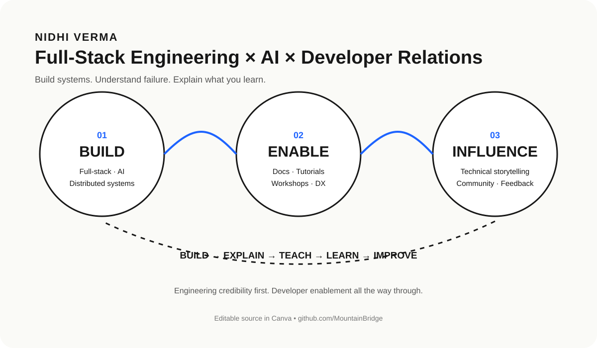

<div align="center">

# Nidhi Verma

### Full-Stack Engineering × AI × Developer Relations

**Build systems. Understand failure. Teach what you learn.**

[LinkedIn](https://www.linkedin.com/in/nidhiverma200/) · [GitHub](https://github.com/MountainBridge)

</div>



<div align="center">

### BUILD → EVALUATE → EXPLAIN → TEACH → IMPROVE

</div>

---

## What I work on

<table>
<tr>
<td width="25%" valign="top">

### BUILD
**Full-Stack**

React · TypeScript  
Java · Spring Boot  
Node · REST APIs  
Databases · Cloud

</td>
<td width="25%" valign="top">

### ENGINEER
**AI Systems**

Agents · RAG  
MCP · Context  
Evaluation  
Observability

</td>
<td width="25%" valign="top">

### SCALE
**Distributed**

Kafka · Events  
Streaming  
Retries · DLQ  
Idempotency

</td>
<td width="25%" valign="top">

### ENABLE
**DevRel**

Docs · Tutorials  
Workshops  
Developer Experience  
Technical storytelling

</td>
</tr>
</table>

---

## Featured engineering

| Area | What you'll find |
|---|---|
| **AI Engineering** | Evaluation, agents, RAG, MCP, regression and evidence-driven investigation |
| **Regression Investigator** | Change → context → user journeys → blast radius → evidence → human decision |
| **Distributed Systems** | Kafka, event contracts, consumer behaviour, retries, replay and failure handling |
| **Real-Time Systems** | Browser streaming, reconnection, ordering, stale state and observability |
| **Data Engineering** | PostgreSQL, MongoDB, APIs, consistency and query behaviour |
| **Developer Enablement** | Runnable labs, tutorials, architecture explanations and workshops |

### Start here

**[KafkaEventPlatform](https://github.com/MountainBridge/KafkaEventPlatform)**  
Event-driven architecture, contracts, consumer groups, retries and DLQs.

**[PostgreSQLEngineeringLab](https://github.com/MountainBridge/PostgreSQLEngineeringLab)**  
Database behaviour, indexing, consistency and API patterns.

**[MongoDBEngineeringLab](https://github.com/MountainBridge/MongoDBEngineeringLab)**  
Document modelling, queries and application integration.

**[Angular-sse](https://github.com/MountainBridge/Angular-sse)**  
Real-time browser communication and failure-aware streaming.

**[AIEvaluationAgentLab](https://github.com/MountainBridge/AIEvaluationAgentLab)**  
Private research lab for AI evaluation and agentic regression investigation.

---

## The DevRel loop

```
        BUILD
          ↓
      EVALUATE
          ↓
       EXPLAIN
          ↓
        TEACH
          ↓
   LEARN FROM DEVELOPERS
          ↓
       IMPROVE
          ↺
```

**Code becomes content.  
Content becomes developer feedback.  
Feedback improves the engineering.**

---

## How I think

> **Problem before technology.**  
> **Evidence before conclusions.**  
> **Failure modes before happy paths.**  
> **Developer experience is part of the engineering.**

Every serious case study follows:

**problem → context → architecture → working slice → failure → evidence → trade-offs → reusable pattern**

---

## 11+ years of engineering

Enterprise software engineering across **full-stack applications, banking workflows, distributed systems, quality engineering, AI evaluation and developer experience**.

Where work is proprietary, examples are generalized rather than presented as public source code.

---

<div align="center">

### Build it. Understand it. Explain it. Teach it. Improve it.

**[Connect on LinkedIn](https://www.linkedin.com/in/nidhiverma200/)**

</div>
