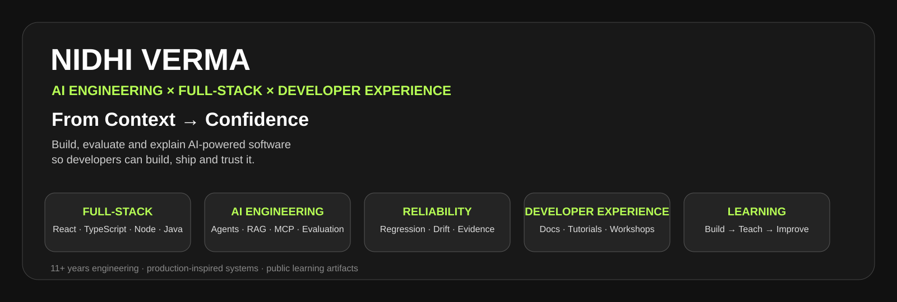

<div align="center">

# Nidhi Verma

### AI Engineering · Full-Stack Engineering · Developer Experience

**I build and teach systems that make AI-powered software reliable, testable and understandable.**



[LinkedIn](https://www.linkedin.com/in/nidhiverma200/) · [MountainBridges](https://github.com/MountainBridge/MountainBridges)

</div>

---

## What I build

| AI ENGINEERING | FULL-STACK | RELIABILITY | ARCHITECTURE | DEVELOPER EXPERIENCE |
|---|---|---|---|---|
| Agents · RAG · MCP · Evaluation | React · TypeScript · Node · Java · APIs | Regression · Drift · Blast Radius | Distributed Systems · Cloud · Events | Docs · Tutorials · Workshops |

## My engineering thesis

**From Context → Confidence**

Modern software is increasingly built with AI, but developers still need a reliable way to understand what changed, test what matters, investigate failures and make decisions with evidence.

I explore that problem through production-inspired engineering systems, generalized so they can be shared publicly without exposing employer source code, credentials, customer data or proprietary workflows.

```text
BUILD → EVALUATE → EXPLAIN → TEACH → IMPROVE
  ↑                                      ↓
  └──────────── developer feedback ─────┘
```

---

## Two flagship projects

### 01 · Agentic Regression Investigator

**AI × Full-Stack × Reliability × Developer Experience**

A public reference implementation for investigating software-change impact using grounded repository context, executable scenarios and evidence-driven agents.

```text
Code / Config Change
        ↓
Grounded Repository Context
        ↓
Knowledge Model + Documentation
        ↓
Business + Technical Scenarios
        ↓
Functional · Null · Negative · Stress Tests
        ↓
Drift + Blast-Radius Detection
        ↓
Agentic Investigation
        ↓
Evidence Pack + Human Decision
```

**The question:** regression should answer more than **“did the test pass?”** It should explain **what changed, what could be affected, what evidence supports the finding and what a human should investigate next.**

[Read the case study →](projects/01-agentic-regression-investigator.md)

---

### 02 · Production AI Application

**AI Application × RAG × Agents × MCP × Evaluation × Cloud**

An end-to-end AI application built to demonstrate the gap between a chatbot demo and an operable engineering system.

```text
Web UI → API → AI Orchestration
              ├─ RAG
              ├─ Tools / MCP
              └─ Agent Workflow
                     ↓
              Ground-Truth Evaluation
                     ↓
          Observability · Safety · CI/CD
```

[Read the project plan →](projects/02-production-ai-application.md)

---

## Why this is a DevEx portfolio

I don't separate engineering from developer relations.

**I BUILD** the system.

**I EVALUATE** whether it works and where it fails.

**I EXPLAIN** the architecture and trade-offs.

**I TEACH** through tutorials and workshops.

**I IMPROVE** from developer feedback.

Every major project follows:

**Problem → Users → Context → Constraints → Architecture → Implementation → Failure → Validation → Communication → Feedback**

---

## Casebook

- **Context Engineering for Regression Automation** — repository context → living documentation → executable scenarios.
- **Agentic Regression Investigation** — change-impact investigation with evidence and human review.
- **AI Evaluation Is a Systems Problem** — ground truth, regression, observability and failure analysis.
- **From Ambiguity to Architecture** — turning unclear requirements into explicit system decisions.
- **Failure Modes Before Features** — designing around what can fail, not only the happy path.
- **Developer Journey End to End** — documentation, examples, tooling and feedback as one system.

---

## Learn with the projects

**30-second read** → idea  
**2-minute read** → architecture + trade-offs  
**10-minute lab** → runnable example  
**Workshop** → build it with me  
**Case study** → understand the engineering decision

**The goal: make senior engineering knowledge reproducible.**

---

## About me

11+ years of enterprise software engineering across **full-stack applications, banking workflows, distributed systems, quality engineering, AI evaluation and developer experience**.

I am building a public body of work at the intersection of **AI engineering and developer experience** — with a focus on making complex systems easier to build, evaluate, explain and operate.

Where the underlying work is proprietary, the public material uses generalized patterns, synthetic examples and reusable learning artifacts.

---

<div align="center">

### Build it. Understand it. Explain it. Teach it.

[Connect on LinkedIn](https://www.linkedin.com/in/nidhiverma200/)

</div>
