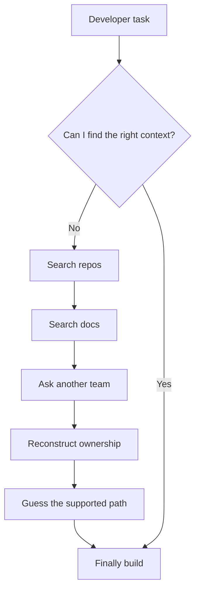
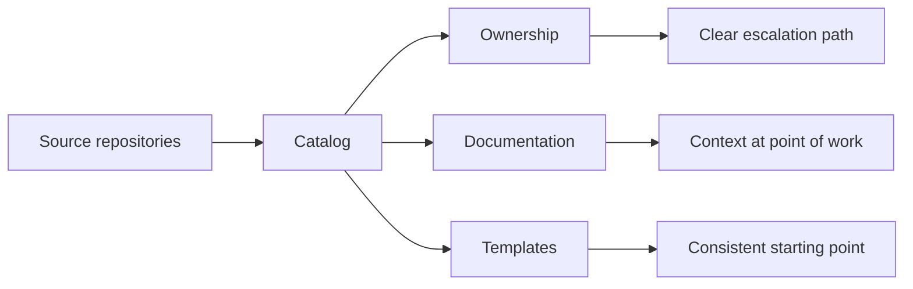

# Case 01 — When Information Fragments

## The problem

A growing engineering organization can have all the ingredients of a working system—services, APIs, repositories, deployment tooling, documentation and experts—while making a simple task surprisingly difficult:

> **Where do I start, what should I use, and who owns the thing I depend on?**

This is not primarily a documentation problem. It is a **discovery, ownership and cognitive-load problem**.

## Why it becomes hard

As systems and teams multiply, useful context gets distributed across repositories, wikis, chat, dashboards and individual engineers. The engineer now spends time reconstructing the system before writing code.

## Reference case — Spotify / Backstage

Spotify describes reaching a point where infrastructure became fragmented and engineers spent more time finding APIs, framework versions, service ownership and documentation than building software. Backstage emerged as an abstraction layer over infrastructure and tooling, combining a software catalog, templates and documentation discovery. citeturn392938search2turn392938search5

TechDocs extends this idea by keeping Markdown documentation with code and publishing it centrally. Spotify reported that TechDocs accounted for about 20% of Backstage traffic in its 2020 announcement; current Backstage documentation describes thousands of documentation sites. citeturn392938search1turn392938search4

## The engineering move

Do not respond to fragmentation with one giant wiki. Build a **system of discoverability**:

The important abstraction is not the portal UI. It is the relationship between **software → owner → documentation → supported way to start → feedback**.

## Trade-offs

| Choice | Benefit | Risk |
|---|---|---|
| Central catalog | Fast discovery | Can become stale if ownership is manual |
| Docs beside code | Context stays near implementation | Requires documentation discipline |
| Templates | Faster starts and consistency | Can encode outdated assumptions |
| Plugins/integrations | One place for many tools | Portal complexity can grow rapidly |

## Design test

A useful implementation should let a new engineer answer these questions quickly:

- What is this component?
- Who owns it?
- What does it depend on?
- How do I run or change it?
- What is the supported path?
- What should I do when the documented path fails?

## What to measure

Useful signals are behavioral rather than vanity metrics: time to first successful task, search-to-success time, repeated questions, documentation gaps, ownership failures and unresolved friction.

## Related portfolio work

- [Designing a Developer Journey End to End](../articles/developer-journey-end-to-end.md)
- [Scaling Technical Knowledge](../patterns/scaling-technical-knowledge.md)
- [Reference Implementations](../articles/reference-implementations.md)

## References

- Backstage, “The Spotify Story.”
- Backstage, “Technical overview.”
- Spotify, “Announcing TechDocs.”
