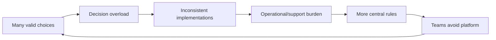
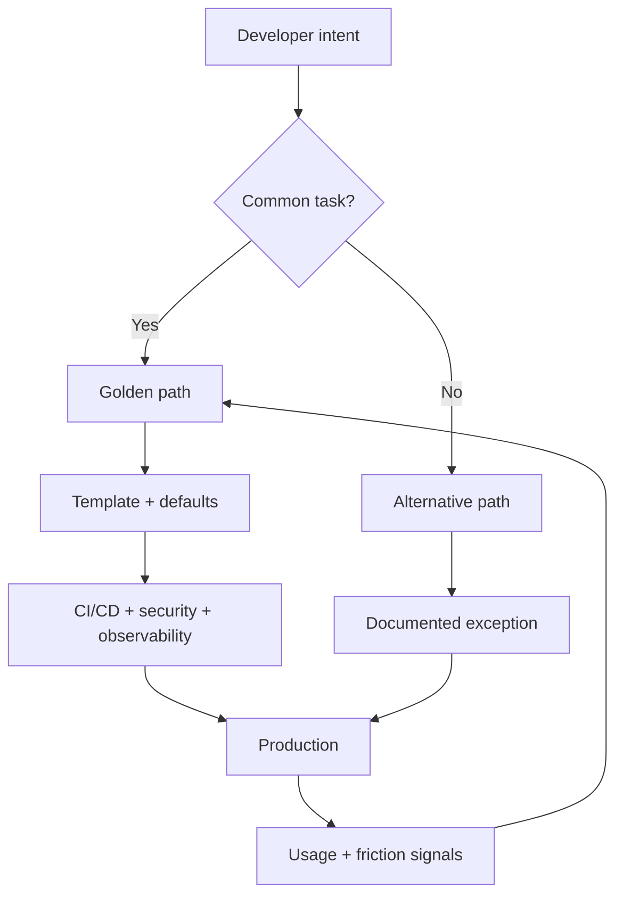

# Case 02 — A Paved Road Without a Prison

## The problem

An engineering organization wants consistency: secure defaults, standard observability, deployment conventions, supported frameworks and predictable operations.

The obvious solution is to publish standards. The harder problem is this:

> **How do you make the right path easy without making every unusual problem impossible?**

## The failure mode

Too little standardization creates decision overload. Too much creates a platform that teams fight instead of use.

## Reference case — Google Cloud / Golden Paths

Google Cloud describes Golden Paths as opinionated, self-service templates for common engineering tasks. Its guidance emphasizes a single clear method for a specific task, reduced cognitive load, an end-to-end development-to-production path, self-service access, transparent abstractions, flexibility, and optional adoption rather than forced compliance. citeturn392938search0

The critical idea is **opinionated, not opaque**. Developers should be able to use the default safely while still understanding what sits underneath when debugging or optimizing.

## Reference case — Spotify

Spotify's Golden Paths are described as “opinionated and supported paths,” with tutorials and supporting documentation. Their experience also shows the maintenance problem: long paths cross team boundaries, ownership becomes distributed, and dependencies between documentation sections create friction. citeturn392938search1

## The engineering move

Design the path as a product with explicit escape hatches.

## What belongs in the path

A useful path can package the repetitive parts of delivery: project skeleton, dependency policy, testing, CI/CD, infrastructure, security guardrails, observability and documentation.

It should not hide the underlying system or pretend that one template fits every workload.

## Design test

A good paved road answers four questions:

1. What does this solve?
2. What do I get automatically?
3. What can I change safely?
4. When should I leave the path, and how?

## Trade-offs

| Strategy | Strength | Failure mode |
|---|---|---|
| No defaults | Maximum autonomy | Every team solves the same infrastructure problem |
| One mandatory path | Strong consistency | Exceptions become painful workarounds |
| Opinionated optional paths | Fast common case + autonomy | Requires good boundaries and maintenance |

## Related portfolio work

- [From Ambiguity to Architecture](../articles/ambiguity-to-architecture.md)
- [Architecture Decision Records That Survive the Original Team](../articles/architecture-decisions-that-survive.md)
- [Designing a Developer Journey End to End](../articles/developer-journey-end-to-end.md)

## References

- Google Cloud, “Golden paths for engineering execution consistency.”
- Spotify / Backstage, “Announcing TechDocs.”
