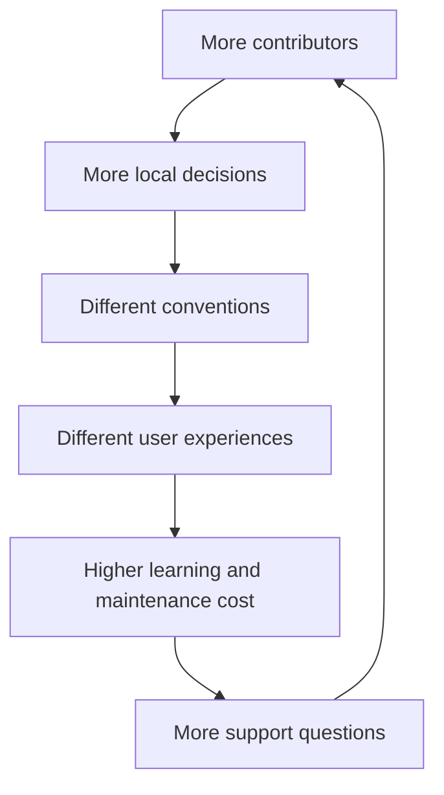

# Case 03 — When Contribution Creates Fragmentation

## The problem

A successful platform often grows by accepting more contributors. That sounds like a pure positive until every contributor starts making slightly different decisions.

The result is a platform with many implementations that are individually reasonable but collectively inconsistent.

The hard problem is not “how do we control contributors?” It is:

> **How do we create enough shared structure that independent contribution remains coherent?**

## Reference case — Shopify CLI

Shopify describes an earlier Ruby CLI where contributions were loosely aligned and produced fragmentation. For the Node CLI, the team introduced shared code patterns, UI patterns/components, conventions and principles, packaged common functionality, and used static analysis to automate parts of the consistency model. citeturn392938search3

This is an important distinction: consistency was moved from informal knowledge into **interfaces, patterns and tooling**.

## The engineering move

Instead of reviewing every decision centrally, make the common decisions easy to inherit.

### Four layers of scalable consistency

**Principles** define what “good” means.

**Patterns** define repeatable shapes for common problems.

**Components and libraries** encode the repeated implementation.

**Automation** catches drift without requiring a human to remember every rule.

## A useful mental model

Do not try to centralize all decisions. Centralize the **decisions that should not be repeatedly rediscovered**.

This is why patterns, templates, shared libraries and static checks can be more scalable than a document full of rules.

## Trade-offs

| Choice | Useful when | Risk |
|---|---|---|
| Central review | High-risk architectural decisions | Bottleneck |
| Written conventions | Low-cost consistency | Easy to ignore |
| Shared library/component | Repeated implementation | Coupling |
| Automated checks | Mechanical rules | False positives / rigidity |
| Reference implementations | Learning complex behavior | Can be copied without understanding |

## Design test

A contributor should be able to answer:

- What is the preferred pattern?
- Is there already a component for this?
- Which rules are enforced automatically?
- Where are exceptions appropriate?
- How can a better pattern replace the existing one?

## Related portfolio work

- [Scaling Technical Knowledge](../patterns/scaling-technical-knowledge.md)
- [Reference Implementations](../articles/reference-implementations.md)
- [Failure Modes Before Features](../articles/failure-modes-before-features.md)

## Reference

- Shopify Engineering, “From Ruby to Node: Overhauling Shopify’s CLI for a Better Developer Experience.”
