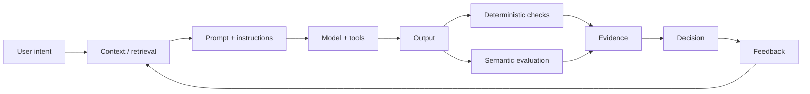

# Case 04 — When AI Looks Right but Is Wrong

## The problem

A conventional software test can often assert an exact value. AI systems are different: the output can be syntactically valid, fluent and plausible while still being incorrect, incomplete, unsafe or poorly grounded.

That creates a different engineering question:

> **How do we know an AI system is working for the intended task, not merely producing convincing text?**

## The failure mode

A model-centric test often looks like this:

```text
input → model → compare output
```

A production system needs a wider boundary:



## Evidence from evaluation research

Recent surveys on Retrieval-Augmented Generation evaluation argue that evaluation must consider more than generated text: retrieval quality, factual correctness, faithfulness, safety and efficiency all matter. Research on LLM-as-a-Judge also highlights reliability, consistency and bias as central concerns. citeturn492971academia60turn492971academia61turn492971academia62turn492971academia63

The implication is architectural: **the unit of evaluation is the system and its evidence, not the model response alone**.

## The engineering move

Build a layered evaluation system.

| Layer | Question | Example |
|---|---|---|
| L1 — Functional | Did the system perform the basic task? | Required field present |
| L2 — Scenario | Does it work for representative journeys? | Typical user request |
| L3 — Failure | Does it degrade correctly? | Missing context, conflicting input |
| L4 — System | What happens when this changes? | Model/retriever/prompt regression |

Semantic evaluation should be bounded by a rubric, evidence requirements, explicit failure modes, calibration and human escalation where confidence is insufficient.

## Design test

A useful evaluator should make it possible to answer:

- What evidence did the system use?
- Which parts are mechanically checked?
- Which parts require semantic judgment?
- What counts as failure?
- How do we know the evaluator itself is reliable?
- What changed since the previous regression run?

## Related portfolio work

- [LLM Evaluation Is a Systems Problem](../articles/llm-evaluation-systems.md)
- [Context Engineering for Regression Automation](../articles/context-engineering-regression-automation.md)
- [Making AI Systems Production-Ready](../articles/ai-production-readiness.md)

## References

- “Evaluation of Retrieval-Augmented Generation: A Survey” (2024).
- “Retrieval Augmented Generation Evaluation in the Era of Large Language Models: A Comprehensive Survey” (2025).
- “A Survey on LLM-as-a-Judge” (2024).
- “From Generation to Judgment: Opportunities and Challenges of LLM-as-a-Judge” (2024).
