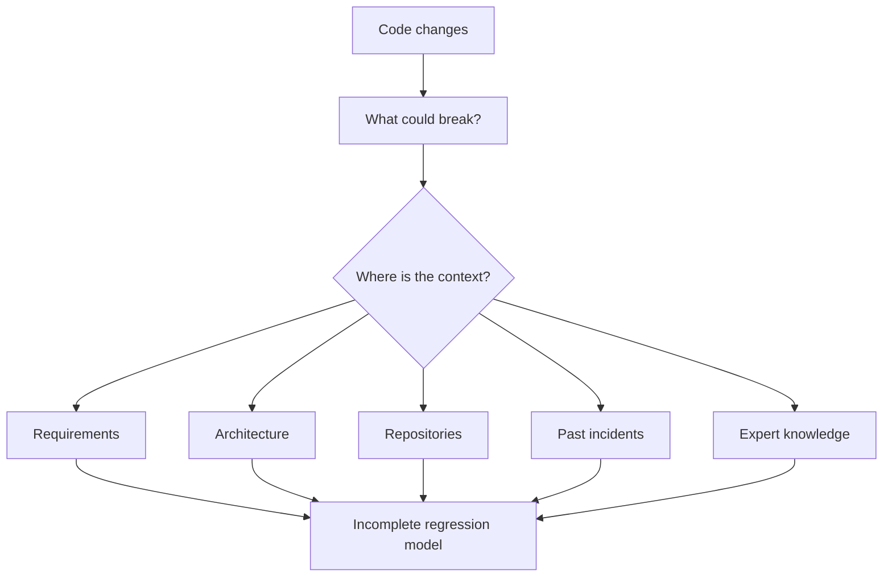
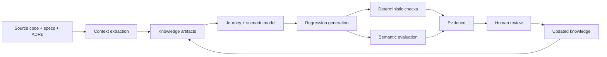

# Case 05 — When Regression Becomes a Knowledge Problem

## The problem

A regression suite can contain hundreds of tests and still miss the change that matters.

The reason is often not a lack of test count. The missing information lives elsewhere: in architecture diagrams, requirements, user journeys, implementation assumptions, operational knowledge and the reasoning of people who understand the system.

The real question becomes:

> **How do you turn distributed engineering context into repeatable regression decisions?**

## The failure mode

If context is not captured, every change requires humans to reconstruct it again.

## The engineering move

Treat context extraction as a pipeline.

The AI component is useful when the system must reason across distributed context. It does not remove the need for deterministic assertions, explicit evidence and human judgment at the right boundaries.

## What good context looks like

Each meaningful scenario should preserve enough information to explain:

- who is using the system;
- what journey they are trying to complete;
- what data and assumptions are involved;
- what dependencies and invariants matter;
- what changed;
- what could break;
- what evidence would show that behavior remains correct.

## Why this scales better

The output is not merely a larger test suite. It is a reusable knowledge layer that can support regression, onboarding, debugging, design review and future changes.

## Design test

For every generated regression decision, someone should be able to trace:

**source context → extracted knowledge → scenario → assertion/evaluator → evidence → decision**

That traceability is the difference between automation that is impressive and automation that can be trusted.

## Related portfolio work

- [Context Engineering for Regression Automation](../articles/context-engineering-regression-automation.md)
- [LLM Evaluation Is a Systems Problem](../articles/llm-evaluation-systems.md)
- [Failure Modes Before Features](../articles/failure-modes-before-features.md)

## Reference

This case study is a generalized engineering pattern rather than a claim about a specific external organization's implementation. Its evaluation model is informed by current RAG and LLM-as-a-Judge research; see [Research & Evidence](../research/evidence-base.md).
