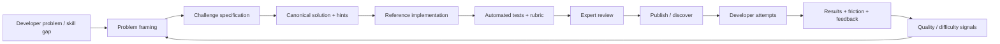

# Problem Map: What This Casebook Already Solves for HackerRank

This is a portfolio mapping, not a claim about HackerRank's internal architecture. The HackerRank job description provides the target problem space; the casebook demonstrates reusable engineering strategies for those problem classes.

The role asks for systems that can engage developers, build a global expert network, curate high-quality hands-on questions with problem descriptions/canonical solutions/hints, support participation, measure engagement, collaborate across product and developer ecosystems, and explain complex technical problems through hands-on examples. citehttps://www.linkedin.com/jobs/view/4412733901

## The important overlap

| HackerRank problem space | Casebook strategy | Existing article / case | Evidence to add next |
|---|---|---|---|
| Produce high-quality coding challenges at scale | Define a canonical problem contract: problem, constraints, examples, solution, hints, tests, failure modes, rubric | `failure-modes-before-features`, `reference-implementations`, `llm-evaluation-systems` | A challenge-authoring pipeline |
| Build a reusable expert network | Turn expertise into structured, reviewable contributions instead of one-to-one dependency | `scaling-technical-knowledge`, `architecture-decisions-that-survive` | Expert contribution workflow |
| Curate community-sourced questions | Use validation gates, evidence, rubric, canonical solution and review states | `llm-evaluation-systems`, `reference-implementations` | Question quality gate |
| Keep questions high quality across many authors | Shared primitives + templates + automated checks + review | `scaling-technical-knowledge`, `design-thinking-for-engineers` | Content quality architecture |
| Support developer success | Model the complete journey from discover → understand → try → solve → submit → learn | `developer-journey-end-to-end` | Submission journey case |
| Measure participation and engagement | Measure task success, friction, repeat failure, contribution quality and feedback-to-improvement | `design-thinking-for-engineers`, `scaling-technical-knowledge` | Contributor analytics case |
| Explain complex technical problems | Layered 30s / 2m / deep explanation with diagrams, executable examples and trade-offs | All case studies | Standard article template |
| AI-driven workflows | Context engineering + deterministic checks + semantic evaluation + human review | `context-engineering-regression-automation`, `llm-evaluation-systems`, `ai-production-readiness` | Challenge-generation architecture |
| Scale without losing quality | Build a system that makes good contribution easier and reviewable | `scaling-technical-knowledge`, `patterns/` | End-to-end contribution flywheel |
| Ambiguous developer requests | Clarify intent, context, constraints and expected behaviour before solution | `ambiguity-to-architecture` | Interactive problem-framing example |
| Real-world engineering tasks rather than toy problems | Use repository-level tasks, realistic context and failure-oriented evaluation | `failure-modes-before-features`, `ai-production-readiness` | SWE-bench-style case |
| Ecosystem credibility | Ground patterns in public research, practitioner reports and external engineering examples | `research/evidence-base.md`, `examples/README.md` | More primary references |

## The strongest existing matches

### 1. `scaling-technical-knowledge.md`

This is the closest match to the underlying scaling problem: expert knowledge → explicit mental model → reference example → supported path → self-service → contribution → feedback → improved pattern.

It demonstrates the architectural idea that expertise should become a reusable system rather than remain locked in individuals.

### 2. `reference-implementations.md`

The HackerRank role explicitly values hands-on examples. This article establishes the quality bar for those examples: a real task, honest architecture, failure path, operational notes and a clear explanation of what changes in production.

### 3. `developer-journey-end-to-end.md`

This maps directly to developer success. The important shift is from “the API works” to “the person can discover, understand, try, integrate, debug, operate and extend successfully.”

### 4. `llm-evaluation-systems.md`

This provides the strongest quality-control pattern for community-generated technical content: explicit rubrics, deterministic checks where possible, semantic evaluation where necessary, evidence, calibration and human escalation.

### 5. `failure-modes-before-features.md`

A coding challenge is only useful when its failure modes are understood. This article provides the reusable method for designing tasks and evaluations that test meaningful boundaries instead of producing arbitrary edge cases.

### 6. `ambiguity-to-architecture.md`

High-quality technical questions often begin as ambiguous requests. This article provides the framing strategy for turning ambiguity into an evaluable engineering problem.

## The bigger opportunity: build a challenge system

The current casebook explains the individual patterns. The next major case should connect them into one concrete architecture:

That architecture is particularly strong because it combines content quality, developer success, AI-assisted workflows, contribution and measurement into one system.

## What should be added next

The casebook should grow into a **problem-pattern library**, not a finite list of articles.

The reusable taxonomy should cover recurring classes such as:

- ambiguity and requirements
- API and contract design
- distributed systems and consistency
- asynchronous workflows and idempotency
- caching and invalidation
- event-driven systems
- resilience and graceful degradation
- observability and incident response
- authentication and authorization
- data modeling and migration
- performance and capacity planning
- frontend architecture and micro-frontends
- developer journeys and onboarding
- platform engineering and golden paths
- documentation and knowledge systems
- contribution and governance
- AI context engineering
- RAG systems
- LLM evaluation
- agentic workflows
- security and trust boundaries
- cost / latency / quality trade-offs

The goal is not literally to document every problem in the world. It is to build a **portable strategy library for the recurring classes of hard engineering problems**—and make every new case reusable as a pattern.

## Portfolio rule

Every new case should answer five questions:

1. What real problem does this represent?
2. Why is the problem difficult?
3. What pattern or architecture solves it?
4. How would we implement and validate it?
5. What evidence and real-world examples support the approach?
