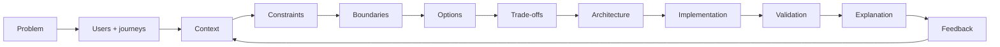
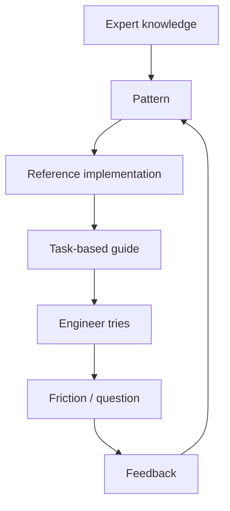
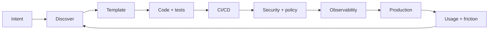
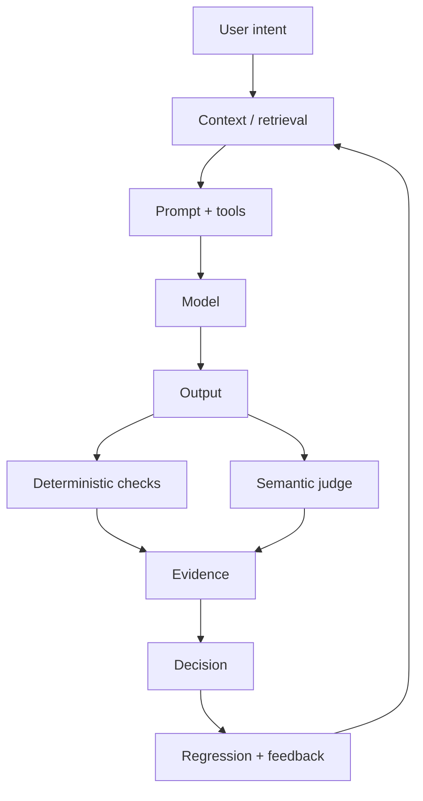
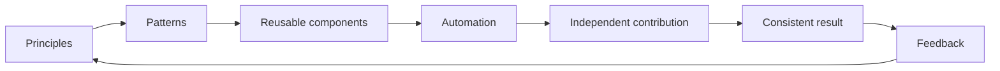

# Casebook Diagrams

These diagrams are the quick-grasp layer. Read the picture first; open the linked case for the detailed reasoning.

## 1. From problem to system

**Read it as:** do not jump from request to technology. The architecture is the result of framing and constraints.

## 2. Knowledge that scales

**Read it as:** the reusable asset is not documentation alone. It is a feedback loop connecting explanation, implementation and real use.

## 3. A golden path

**Read it as:** standardization works when the supported path covers the complete journey and remains transparent and adaptable.

## 4. AI evaluation

**Read it as:** evaluate the chain, not only the generated text.

## 5. Contribution without chaos

**Read it as:** encode the repeated decisions once so contributors can spend their time on the differentiated problem.
