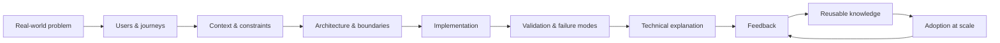
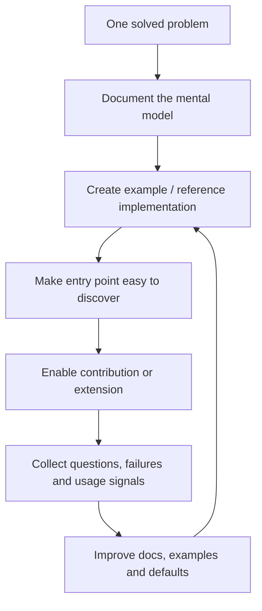
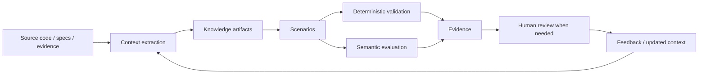

# Portfolio Model — One-Page Mental Model

The portfolio is organized around a repeatable engineering loop.

## What each stage produces

| Stage | Output | Question |
|---|---|---|
| Problem | Problem statement | What are we actually solving? |
| Users | Personas + journeys | For whom, and at which moment? |
| Context | Requirements + constraints | What makes this problem non-trivial? |
| Architecture | Boundaries + decisions | Why is the system shaped this way? |
| Implementation | Runnable slice | Can someone build or use it? |
| Validation | Tests + evidence | How do we know it works? |
| Explanation | Diagram + guide | Can another engineer understand it quickly? |
| Feedback | Observations + issues | Where does the design break down? |
| Reuse | Patterns + templates | What should not be rediscovered? |
| Scale | Self-service + contribution paths | Can the system work beyond the original author? |

## The scaling loop

The goal is not to maximize content. The goal is to make useful technical knowledge increasingly **discoverable, usable, teachable, and reusable**.

## AI system loop

This makes the repository itself part of the engineering system: decisions, examples, evidence and explanations remain inspectable and reusable.
