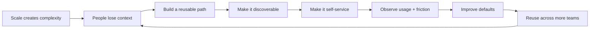

# Real-World Examples

The examples in this portfolio are chosen to show how the patterns appear in systems people actually use. They are reference cases, not claims of personal ownership.

## 1. Spotify → Backstage

**Problem:** growth created fragmented infrastructure, scattered documentation, unclear service ownership and high cognitive load.

**Pattern:** centralized software catalog + documentation + templates + plugins.

**Why it matters:** the system turns discovery and setup into a self-service workflow rather than requiring every engineer to become an expert in the underlying infrastructure.

**Portfolio lesson:** when complexity grows, centralize the *experience* without centralizing every implementation decision.

Source: Backstage, The Spotify Story — https://backstage.io/docs/overview/background/

Related: [`../patterns/scaling-technical-knowledge.md`](../patterns/scaling-technical-knowledge.md)

---

## 2. Spotify → Golden Paths + TechDocs

**Problem:** supported engineering practices existed across teams, but long tutorials, distributed ownership and dependency chains made them difficult to maintain.

**Pattern:** opinionated supported paths, docs-as-code, explicit ownership, discoverability, feedback and usage signals.

**Why it matters:** a good default is more useful when people can discover it, understand it, execute it and report where it fails.

Source: Backstage TechDocs — https://backstage.io/blog/2020/09/08/announcing-tech-docs/

---

## 3. Google Cloud / Internal Developer Platforms

**Problem:** developers lose time and cognitive capacity navigating infrastructure complexity.

**Pattern:** curated templates, golden paths, self-service workflows and automation that move repetitive infrastructure decisions into a platform layer.

Google Cloud describes golden paths as a single, clear, opinionated way to accomplish a task, with reduced cognitive load, development-to-production coverage, self-service and transparent abstraction.

**Portfolio lesson:** the highest-leverage developer tooling often makes the correct path the easiest path without hiding the system underneath.

Sources:
- https://cloud.google.com/blog/products/application-development/golden-paths-for-engineering-execution-consistency
- https://cloud.google.com/discover/what-is-an-internal-developer-platform

---

## 4. Shopify → CLI as a shared platform

**Problem:** loosely aligned contributions created fragmentation across product surfaces.

**Pattern:** shared command patterns, UI components, conventions, principles, automation and a common package that encodes the platform foundation.

**Why it matters:** consistency does not have to come from central approval. It can come from reusable primitives and automated guardrails that make the preferred implementation path obvious.

Source: Shopify Engineering — https://shopify.engineering/overhauling-shopify-cli-for-a-better-developer-experience

---

## 5. Uber → Developer Experience at scale

**Problem:** engineers need to move from concept to deployed technology without repeatedly reconstructing build, training and operational knowledge.

**Pattern:** documentation, training, build systems and development frameworks treated as one connected engineering experience.

**Portfolio lesson:** technical enablement becomes more scalable when learning material, tooling and delivery workflows reinforce each other.

Source: Uber Engineering — https://www.uber.com/ug/en/blog/developer-experience/

---

## 6. InnerSource → Extensions for Sustainable Growth

**Problem:** a successful project can receive more contributions than a small maintainer group can safely absorb.

**Pattern:** allow extensions to live outside the core until they prove value, while providing a discoverable and repeatable integration path.

**Why it matters:** scale does not always mean putting everything into the center. Sometimes the architecture should create safe boundaries for independent contribution.

Source: InnerSource Patterns — https://patterns.innersourcecommons.org/p/extensions-for-sustainable-growth

---

## 7. DORA → AI as an amplifier

**Problem:** teams can adopt AI tools and expect immediate productivity gains, while the surrounding system still has weak feedback loops, poor quality practices or fragmented internal knowledge.

**Pattern:** improve the enabling system around AI: user-centricity, version control, accessible internal data, small batches, quality platforms, and continuous improvement.

**Portfolio lesson:** new capability amplifies the system it enters. Fix the system, not only the tool.

Source: DORA 2025 — https://dora.dev/research/2025/dora-report/

---

## 8. AI evaluation → judge the system, not the string

**Problem:** an apparently good LLM response can still fail the real user journey because retrieval, context, tools, constraints or evaluation criteria were wrong.

**Pattern:** evaluate the end-to-end chain with explicit rubrics, evidence, deterministic checks, semantic evaluation and human escalation where required.

Sources:
- https://arxiv.org/abs/2411.15594
- https://arxiv.org/abs/2405.07437
- https://arxiv.org/abs/2504.14891

---

## Common thread

The recurring engineering move is simple:

**move knowledge from people into systems without removing the reasoning people need to understand the system.**
