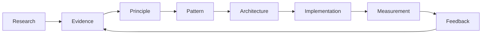

# Research & Reference Layer

This directory is the evidence layer for the portfolio.

The goal is to keep **source → principle → pattern → implementation → measurement** traceable.

## Evidence base

See [`evidence-base.md`](evidence-base.md) for the curated bibliography and practical takeaways.

## Selection rules

Prefer primary research, systematic or multivocal reviews, original engineering reports, and mature practitioner patterns. For fast-moving areas such as AI-assisted engineering and LLM evaluation, prefer recent surveys plus the strongest available primary sources.

Avoid link dumps. A source belongs here when it changes a design, implementation, documentation, measurement or adoption decision.

## Research threads

### Developer experience
Flow, friction, cognitive load, feedback, developer goals, code quality and infrastructure support.

### Onboarding and knowledge transfer
Task-based onboarding, mentorship, documentation structure, collaborative tooling and cognitive-load reduction.

### Reusable systems and participation
Patterns, contribution paths, self-service, governance, maintenance and feedback loops.

### Architecture and alignment
Architecture decision records, alternatives, consequences, distributed decision-making and evolutionary architecture.

### Golden paths and platforms
Opinionated supported paths, discoverability, self-service, templates, automated delivery and transparent abstractions.

### AI-assisted engineering
AI as an amplifier of the surrounding engineering system; context, version control, data access, quality controls and feedback loops.

### LLM / RAG evaluation
Rubrics, calibration, judge reliability, retrieval quality, generation quality, faithfulness, safety and system-level evaluation.
